<!-- ToC start -->
# Table of Contents

1. [Table of Contents](#table-of-contents)
1. [Attempting to Calculate minimum difficulty](#attempting-to-calculate-minimum-difficulty)
   1. [Problem](#problem)
   1. [Solution](#solution)
   1. [Results](#results)
      1. [Targeting 300 records, 1mil hashes/s, 5s per block, 100 blocks](#targeting-300-records-1mil-hashes/s-5s-per-block-100-blocks)
      1. [Targeting 200 records, 1mil hashes/s, 5s per block, 100 blocks](#targeting-200-records-1mil-hashes/s-5s-per-block-100-blocks)
      1. [Targeting 200 records, 100K hashes/s, 5s per block, 100 blocks](#targeting-200-records-100k-hashes/s-5s-per-block-100-blocks)
      1. [Targeting 200 records, 100K hashes/s, 1m per block, 100 blocks](#targeting-200-records-100k-hashes/s-1m-per-block-100-blocks)
      1. [Targeting 100 records, 100K hashes/s, 5s per block, 100 blocks](#targeting-100-records-100k-hashes/s-5s-per-block-100-blocks)
      1. [Targeting 100 records, 100K hashes/s, with +/- 30% flux in hashrate,  5s per block, 100 blocks](#targeting-100-records-100k-hashes/s-with-+/--30-flux-in-hashrate--5s-per-block-100-blocks)
      1. [Targeting 150 records, 200K hashes/s, with +/- 50% flux in hashrate,  5s per block, 100 blocks](#targeting-150-records-200k-hashes/s-with-+/--50-flux-in-hashrate--5s-per-block-100-blocks)
<!-- ToC end -->

# Attempting to Calculate minimum difficulty

## Problem

Miners need to know when to submit their OPRs, and when they have no chance. Without some attempt at decision making, all miners will submit their top X records (default is 3). This has a few problems. First, a miner with a lot of hashpower may want to submit more, while a miner with less may want to submit less. This X is not a trivial thing to determine (although WhoSoup posted a graph with the likely number you should submit given your % of the network hashpower). Submitting to many records wastes ECs, submitting too few loses potential payouts. Another consequence is that mining could forsee scaling issues. If there exists 1k miners, they will try to submit 3k records at minute 9. This could cause slippage for some entries into the next block, or could impact the network with such short bursts.

Having an intelligent way to target a certain number of OPRs per block could alleviate scaling issues, as well as save miners money.

## Solution

Using: https://github.com/WhoSoup/pegnet/wiki/Mining-Probabilities

Using the math from above, we can estimate what the network's hashrate is. And from that we can estimate the difficulty the network will produce. These numbers are just estimates, so we need to add room for error.

## Results

Below is listed various trials with various parameters. All tests were run using a random uint64 generator as the 'hashing' function to produce hashrates equivalent to what the network will see. My machine can only produce ~30K h/s, but can do the random number generation at ~950K/s.

2 graphs are listed for each scenario.
 - Records Graph. This details the number of records submitted in each block. There is 2 horizontal lines, the target and a horizontal line at 50. We want at least 50 per block. (In an ideal world, exactly 50)
 - Difficulty Graph. This shows the difficulties of the submitted hashes in sorted order.
   - Best is the highest difficulty
   - Last Graded is the 50th
   - Last is the very last hash submitted
   - MinDifficulty is the minimum calculated for the block to hit the target number of records.
   
(All made here: https://docs.google.com/spreadsheets/d/1Sd8rVW-bABAl62e48b3L8rG5YfxbrXF7Ei7BPfGiCE4/edit?usp=sharing)

### Targeting 300 records, 1mil hashes/s, 5s per block, 100 blocks

`simulate blocks --csv stats.csv --target 300`

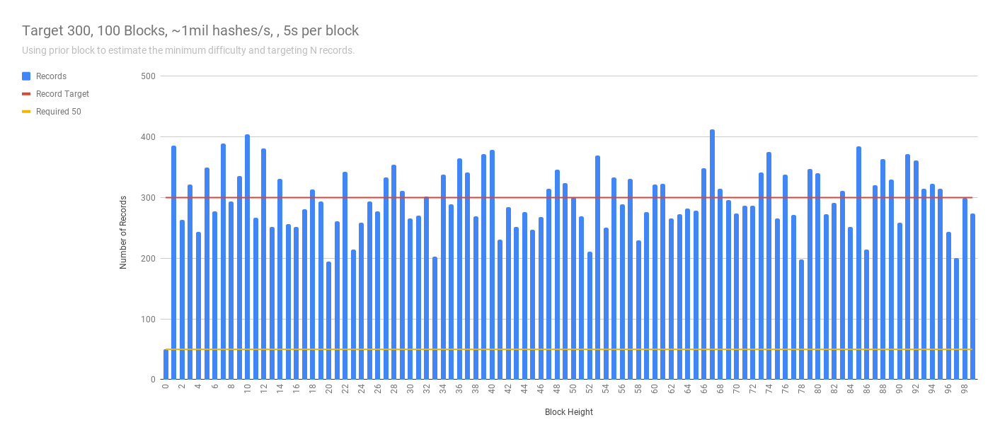
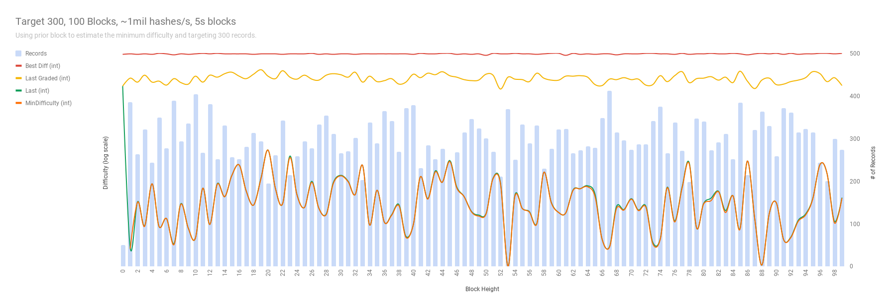

### Targeting 200 records, 1mil hashes/s, 5s per block, 100 blocks

`simulate blocks --csv stats.csv --target 200`

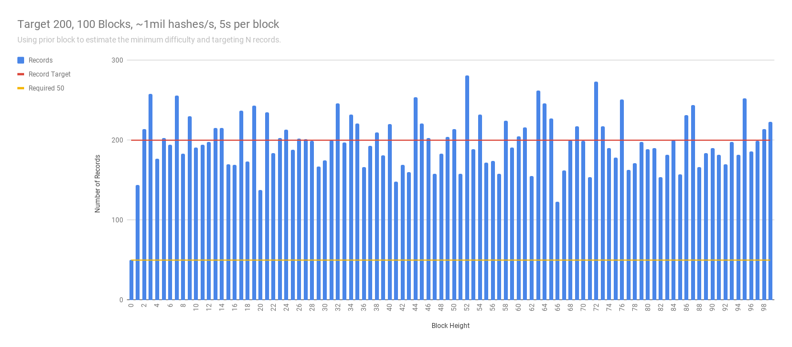
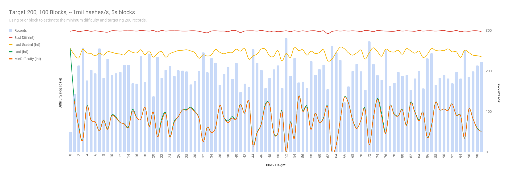

### Targeting 200 records, 100K hashes/s, 5s per block, 100 blocks

`simulate blocks --csv stats.csv --target 200 -r 100000`

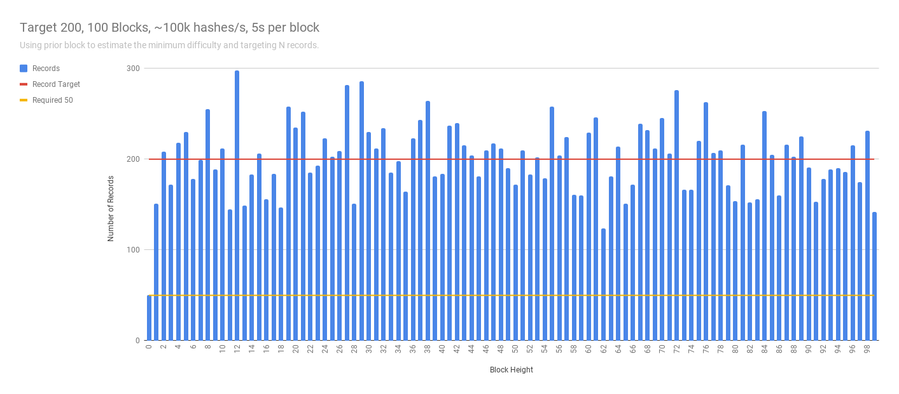
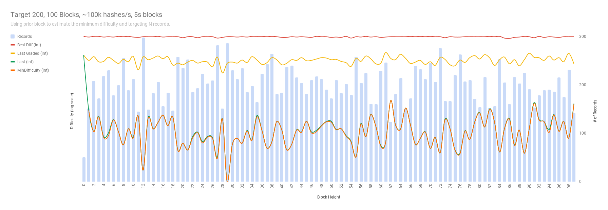

### Targeting 200 records, 100K hashes/s, 1m per block, 100 blocks

`simulate blocks --csv stats.csv --target 200 -r 100000 --time 1m`

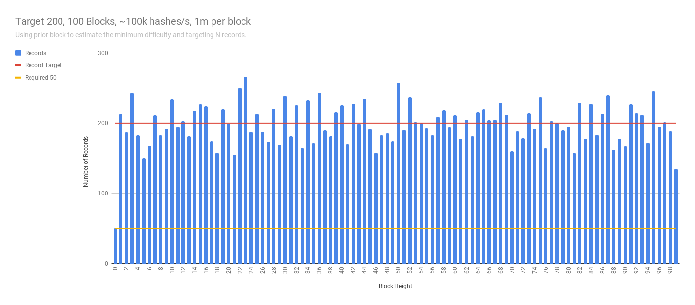
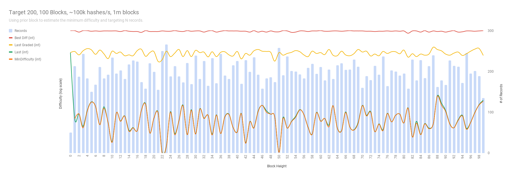

### Targeting 100 records, 100K hashes/s, 5s per block, 100 blocks

`simulate blocks --csv stats.csv --target 100 -r 100000`

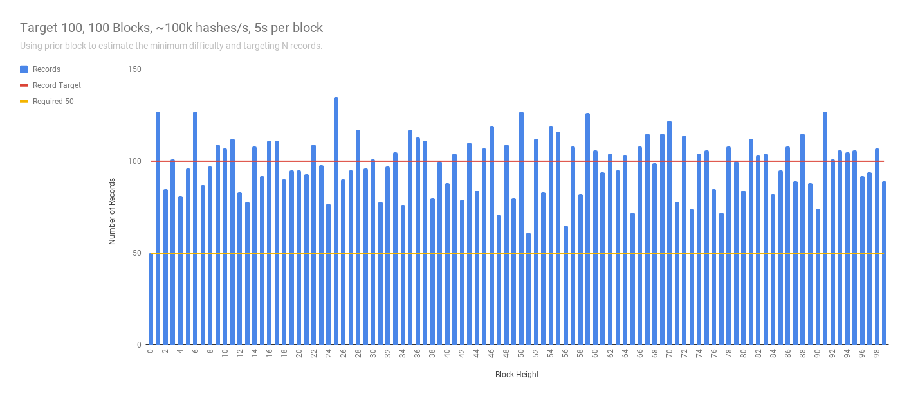
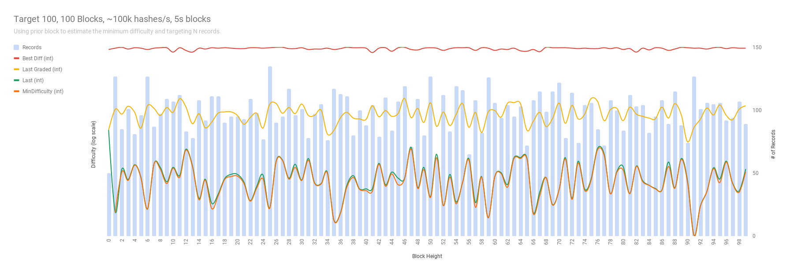

### Targeting 100 records, 100K hashes/s, with +/- 30% flux in hashrate,  5s per block, 100 blocks

`simulate blocks --csv t150_r100k_f50_b100_d5s.csv --target 100 -r 100000 --minflux -30 --maxflux 30`

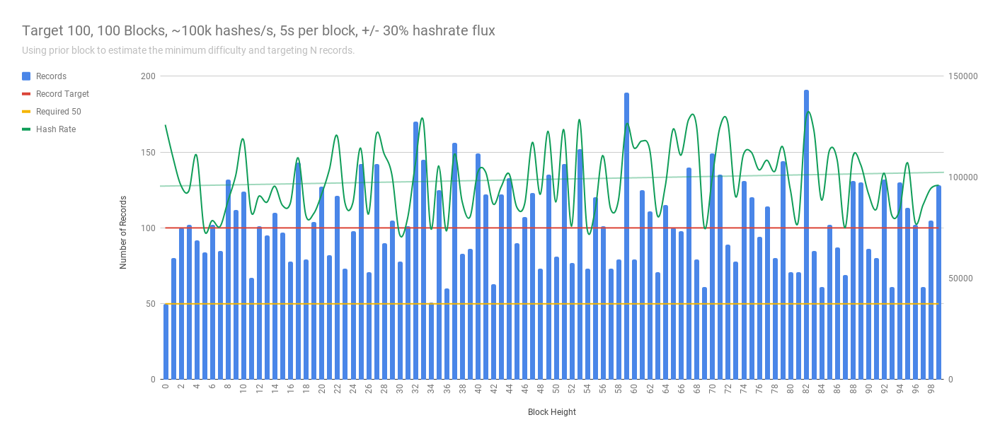
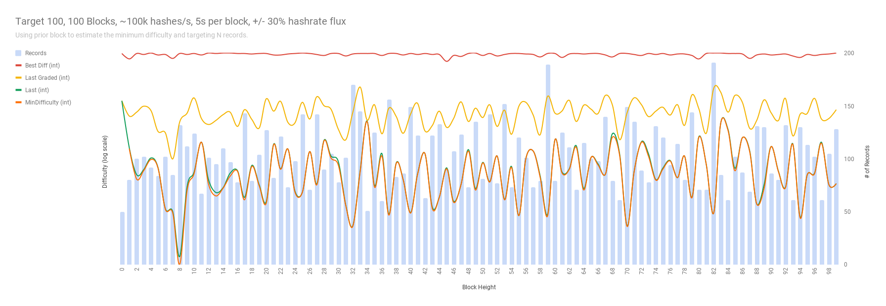

### Targeting 150 records, 200K hashes/s, with +/- 50% flux in hashrate,  5s per block, 100 blocks

`simulate blocks --csv t150_r100k_f50_b100_d5s.csv --target 150 -r 200000 --minflux -50 --maxflux 50`

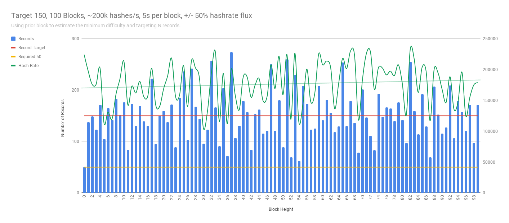
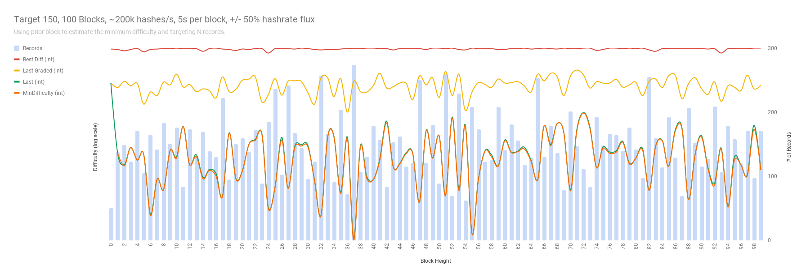